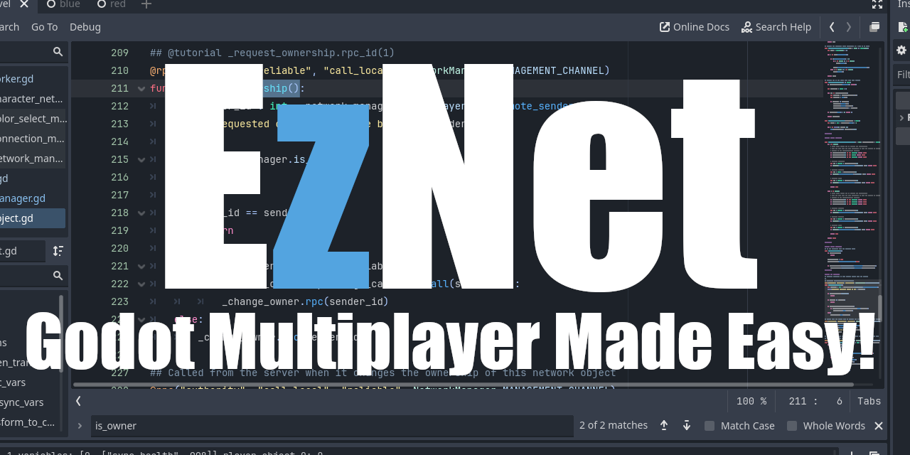

A robust networking solution for Godot 4 that handles object synchronization, ownership, and RPC management with minimal setup.

Built off of the networking solution we built in our Youtube Multiplayer Series! 

[](https://discord.gg/7vnUBmYz)

## 🔧 Features

- **🔄 Automatic Synchronization**
  - Sync variables with `sync_` prefix
  - Transform updates for Node2D/Node3D
  - Delta compression (only sends changed data)

- **⏱️ Tick-Based System**
  - Configurable tick rate (default: 30/sec)
  - Reliable/Unreliable transmission options
  - Dedicated network channels

- **👥 Player Management**
  - Client-server architecture
  - Object ownership system
  - Player connection tracking

- **🛠️ Customization**
  - Validatable spawn requests
  - Batch spawning
  - Extensible Networker base class


## 📦 Installation

### Via Godot Asset Library
1. Open Godot Editor
2. Navigate to AssetLib tab
3. Search for "EzNet"
4. Click Install

### Manual Installation
1. Download the [latest release](https://github.com/RoyasDev/EzNet/releases)
2. Extract the `addons/EzNet` folder
3. Copy to your project's `addons` directory
4. Enable in Project Settings → Plugins

## 🚀 Quick Start

### 1. Add your NetworkManager

Autoload:
1. Project
2. Project Settings
3. Globals
4. Add Base_Network_Manager

Add to your scene root:
1. Add Base_Network_Manager to your scene

GDScript:
```gdscript
@onready var network_manager = preload("res://addons/EzNet/scenes/Base_Network_Manager.tscn")
add_child(network_manager.instantiate())
```

### 2. Create Network Object
```gdscript
extends NetworkObject

# Synced variables (auto-updated across network)
var sync_health := 100
var sync_position := Vector2.ZERO

func _ready():
    super() # Required for initialization
```

### 3. Start Networking

Host Server:
```gdscript
func host_game():
    network_manager._create_server()
```

Join Client:
```gdscript
func join_game(ip: String):
    network_manager.networker.ip = ip
    network_manager._connect_client()
```

## 📚 Core Concepts

### NetWorkManager

The base class for the central controller that manages:

- Connections
- Object spawning
- Tick system
- Player data

### NetworkObject

Base class for synchronized objects:
- Automatic variable syncing (sync_ prefix)
- Ownership management
- Lifecycle methods

### Sync Vars
Any variable on a class that extends NetworkObject with the prefix sync_ will automatically syncronize:

```
@export var health := 100      # Will sync
var sync_score := 0            # Will sync
@export var local_data := {}   # Won't sync
var private_var = null         # Won't sync
```

## 🛠️ Usage Examples

### Spawning Objects

```gdscript
# Client requests spawn
network_manager._request_spawn_helper(
    "res://player.tscn",
    {"position": Vector2(100,100), "team": "blue"}
)

# Server validates spawn
network_manager.validate_request_spawn_callable = func(args):
    return args.get("team") in ["red", "blue"]
```

### Handling Ownership
```gdscript
# Request ownership (client)
func claim_ownership():
    if not _is_owner():
        _request_ownership.rpc_id(1)

# Server validation
network_manager.validate_ownership_change_callable = func(client_id):
    return client_id == legitimate_owner_id
```

## 💡 Tips & Tricks

Optimizing Sync Vars:
```gdscript
var sync_ammo: int
var sync_is_alive: bool

# Avoid - custom types
var sync_inventory : Inventory # Won't serialize over the network
```

Custom Networker:
```gdscript
extends Networker

func host():
    var peer = WebSocketMultiplayerPeer.new()
    peer.create_server(9000)
    return peer
```

## ❓ FAQ

Q: Why aren't my sync vars updating?
A: Ensure:
1. The variable is in a class that extends NetworkObject
2. Variable starts with sync_
3. You called super() in _ready()

Q: How do I change tick rate?
A: Set ticks_per_second in NetworkManager inspector

Q: Can I use WebSockets instead of ENet?
A: Yes! Extend the Networker class (see examples)

## 🎮 Example Projects
Included in /example

1. Team Game - Red vs Blue with spawn zones and sync vars

## 🗺️ Development Roadmap

### Upcoming Features

| Feature                | Status      | Description |
|------------------------|-------------|-------------|
| **Targeted Spawns**    | Planned     | Spawn objects only for specific clients (useful for player-specific items) |
| **Level Management**   | In Progress | Automatic scene synchronization with client-side loading screens |
| **Interpolators**      | Planned     | Built-in transform interpolation for smoother network movement |
| **Interest Management**| Planned     | Network rooms and proximity-based RPCs to optimize bandwidth |

### Future Goals

- **More Example Projects**:
  - Top-down shooter with lag compensation
  - MMO-style chunk loading demo
  - Real-time strategy game example
  - Voice chat integration example

- **Quality of Life**:
  - More pre-built networkers e.g. Websockets, Steam, Epic
  - Automated stress testing tools
  - Godot Editor plugins for setup
  - Unit testing
  - Fully documented wiki

## Developers

Patrick Larsen
Tait Larsen

## 📜 License

MIT License - See LICENSE.md for details

## 💬 Support

Found a bug? Open an Issue
Want to contribute? Submit a PR!
